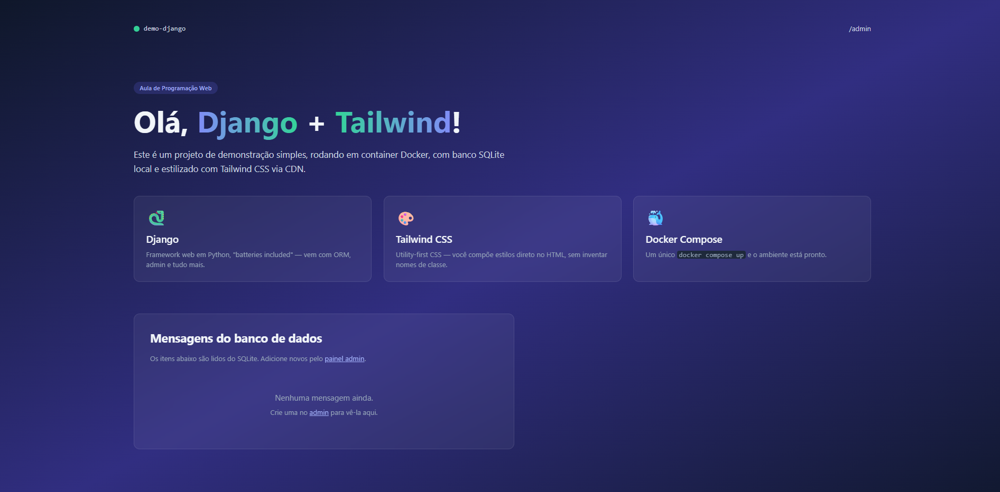

# Sistema Web — Programação Web

## Informações

**Nome:** Diogo Tadeu Campos  
**Curso:** Ciência da Computação  
**Disciplina:** Programação Web  

## Sobre o sistema

Este projeto foi desenvolvido como atividade da disciplina de Programação Web.

## Sistema em execução

Abaixo estão algumas imagens do sistema em execução.

### Tela principal

